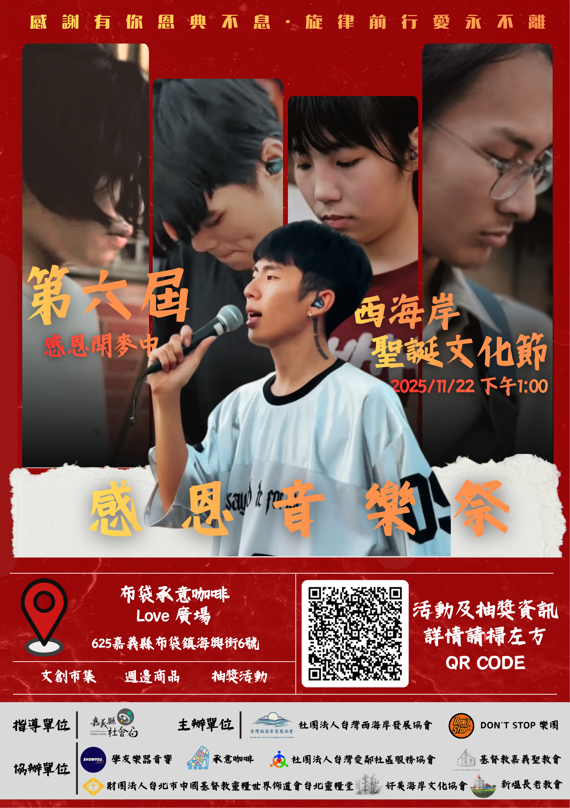

# ✨ 第六屆 感恩文化音樂節：感謝有你 恩典不息

**社團法人台灣西海岸發展協會**誠摯邀請您，在 2025 年 11 月 22 日，一同參與這場充滿愛與旋律的年度盛會——第六屆感恩文化音樂節！

我們相信，每一份感謝都值得被傳遞，每一個生命都應被歌頌。讓我們在音樂中相遇，共同感受溫暖與力量。

---

## 📌 活動資訊總覽

| 項目 | 內容 |
| :--- | :--- |
| **活動主題** | 第六屆 感恩文化音樂節 |
| **日期時間** | **2025 年 11 月 22 日（星期六）** 下午 1:00 開始 |
| **活動地點** | 布袋承意咖啡 Love 廣場 |
| **地址** | 625 嘉義縣布袋鎮海興街 6 號 |
| **活動性質** | 文創市集、攤商、闖關遊戲、音樂演出、抽獎活動 |

---

## 🎵 精彩活動內容與時間表

本次音樂節內容豐富，從市集到專業樂團演出，精彩不間斷！

| 時間 | 內容 | 備註 |
| :--- | :--- | :--- |
| **13:00-14:00** | 市集活動 | 文創、週邊商品 |
| **14:00-14:05** | 開場 & 介紹協會 | |
| **14:05-14:35** | 第一章節・感恩起行 | 讓愛啟程，見證分享 |
| **14:35-14:45** | 靈愛見證、見證分享 | |
| **14:45-15:00** | 感恩集點站 | |
| **15:00-15:40** | **DON'T STOP 樂團演出** | 不容錯過的精彩音樂盛宴！ |
| **15:40-15:50** | 大合照 | |
| **15:50-16:30** | **抽獎活動 & 閉幕** | 豪華好禮等你拿！ |

---

## 🎁 參加辦法與抽獎好禮

完成以下步驟，即有機會抽中**精美好禮** (包含 iPhone 13 尺寸的手機、AirPods 類耳機、風扇、千元禮券等，請以現場實物為準)：

1.  **追蹤訂閱：** 追蹤/訂閱 **IG / YouTube 頻道**：[**Don't Stop 樂團**]。
2.  **現場互動：** 活動現場完成 **闖關遊戲**。

---

## 🤝 主協辦單位

### 主辦單位
* **社團法人台灣西海岸發展協會**
* **承意咖啡**
* **社團法人台灣愛鄰社區服務協會**

### 指導與協辦單位
* 新港天后宮
* 學友樂器音響
* 財團法人台北市中國基督教靈糧世界佈道會宣教發展處
* 研美海岸文化場音
* 新塭長老教會
* （其他指導、贊助單位詳見海報）

---

> 
> *貼心提醒：請隨時關注主辦單位官方社群，獲取最新活動資訊。*